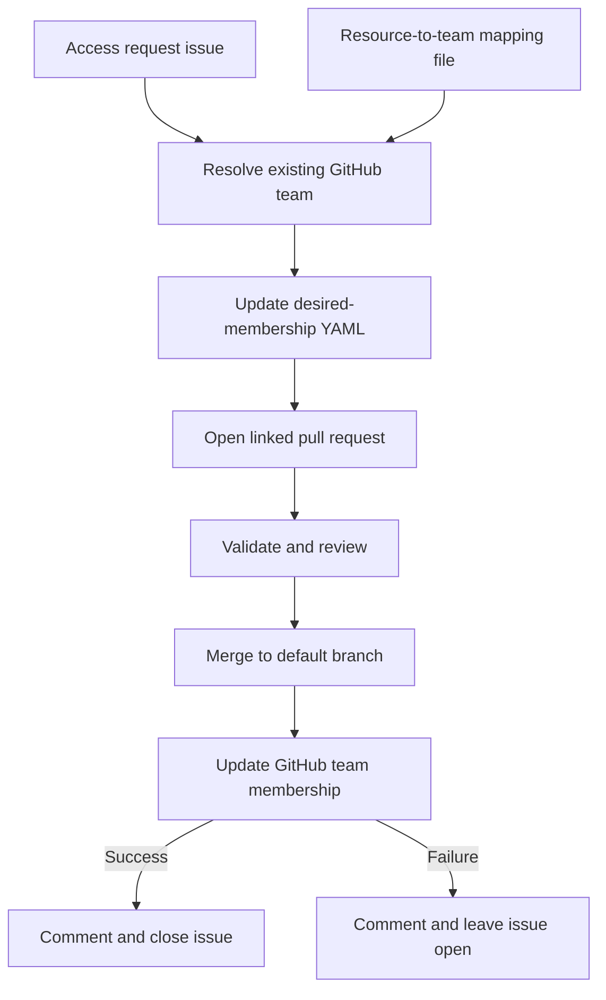

# Lightweight GitHub Team Access POC

## Goal

Build a small IssueOps proof of concept that turns an approved access request into declarative GitHub team membership.

The mapping between GitHub teams, resources, and permissions already exists outside this POC.

## Proposed lightweight IssueOps flow

1. A user submits an access-request issue form containing the target user, requested resource and permission, and justification.
2. IssueOps determines the existing GitHub team that grants the requested access.
3. IssueOps creates a branch and adds the target user to that team's desired-membership YAML file.
4. IssueOps opens a pull request linked to the still-open access-request issue.
5. CI validates the YAML and previews the team membership change.
6. The pull request is reviewed and merged into the default branch.
7. A post-merge workflow updates the GitHub team's membership.
8. If the membership update succeeds, the workflow comments on and closes the issue. If it fails, it comments with the failure and leaves the issue open.



## Resource-to-team mapping

The user requests access to a resource or project and a permission, not necessarily membership in a named team. IssueOps resolves that request through a separate mapping file:

```yaml
mappings:
  - resource: github/payments-api
    permission: admin
    organization: github
    team: team-admins
  - resource: github/payments-api
    permission: push
    organization: github
    team: payments-developers
```

For example, a request for `admin` access to `github/payments-api` resolves to membership in `github/team-admins`. If no mapping or more than one mapping matches, the workflow stops and comments on the issue instead of guessing.

## Desired-state file

Use one minimal YAML file per managed team:

```text
teams/<organization>/<team>.yaml
```

Example:

```yaml
organization: github
team: team-admins
members:
  - hubot
  - octocat
```

The file explicitly contains the organization, team slug, and alphabetized desired member list. Reconciliation uses these fields rather than depending on the filename matching the GitHub team.

The filename should still be descriptive, for example:

```text
teams/github/team-admins.yaml
```

CI can verify that the path and YAML fields agree, catching accidental renames or misplaced files without making the filename the source of truth. Justification and request details stay in the issue, while approval history stays in the linked pull request.
